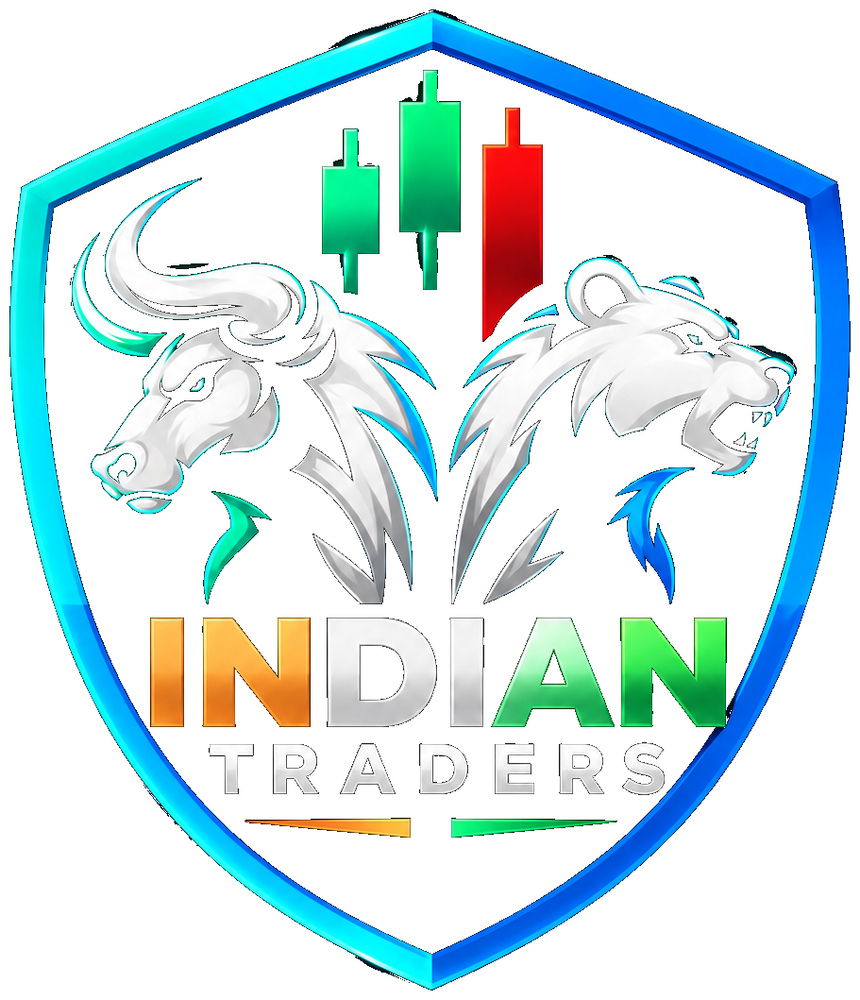
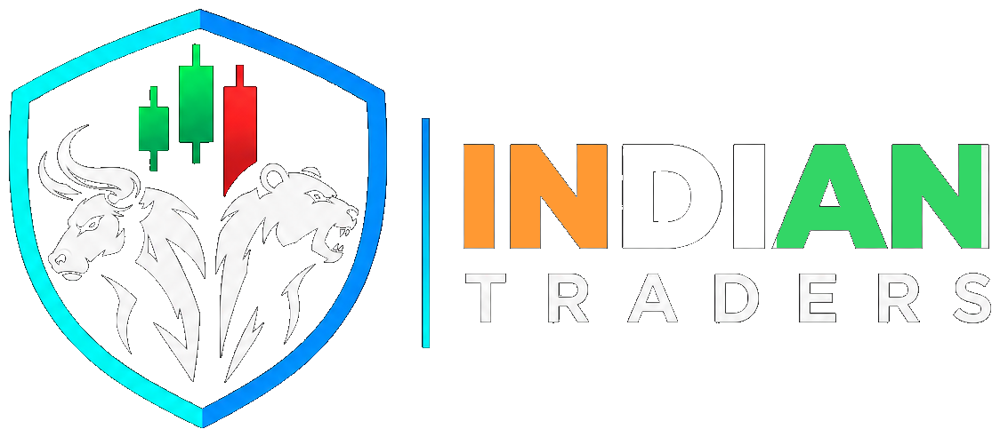

# INDIAN TRADERS — Two Locked Logo Variants

## Locked variants

### 1. Indian Traders Tricolor Shield
- Full shield logo.
- Muscular white bull facing **left**.
- White bear facing **right**.
- Green and red candlesticks at the top.
- Cyan-to-blue shield border.
- `INDIAN` uses the locked tricolor treatment: **saffron / white / green**.
- `TRADERS` is white.
- The complete wording is **inside the shield**.

Main asset:
`assets/indian-traders-tricolor-shield.png`

### 2. Indian Traders Horizontal Shield
- Shield/emblem on the **left**.
- Same muscular bull facing left.
- Same bear facing right.
- Same green/red candlesticks.
- Same cyan-to-blue shield border.
- `INDIAN` uses the **same tricolor treatment** as the Tricolor Shield.
- `TRADERS` is white.
- Wordmark is on the **right**.

Main asset:
`assets/indian-traders-horizontal-shield.png`

---

## Asset list

### Complete logos
- `assets/indian-traders-tricolor-shield.png`
- `assets/indian-traders-horizontal-shield.png`

### Emblems
- `assets/indian-traders-tricolor-shield-emblem.png`
- `assets/indian-traders-horizontal-shield-emblem.png`

### Wordmarks
- `assets/indian-traders-tricolor-wordmark.png`
- `assets/indian-traders-horizontal-wordmark-tricolor.png`

### Source references
- `source/locked_vertical_source.png`
- `source/locked_horizontal_source.png`

### Specification
- `assets/logo_spec.json`

---

## Exact HTML usage

### Vertical shield

```html

```

```css
.logo--vertical {
  width: 180px;
  height: auto;
  display: block;
}
```

### Horizontal shield

```html

```

```css
.logo--horizontal {
  width: 260px;
  height: auto;
  display: block;
}
```

The width values above are starting points. Scale proportionally; never stretch the logo independently in X/Y.

---

## Instagram canvas specification

For use in your Instagram templates:

- Width: **1080 px**
- Height: **1350 px**
- Aspect ratio: **4:5**
- Color space: **sRGB**
- Recommended output: **PNG**
- Keep important logo/text content at least **60 px** from the canvas edge.

```css
.instagram-canvas {
  width: 1080px;
  height: 1350px;
  position: relative;
  overflow: hidden;
  box-sizing: border-box;
}
```

---

## Logo placement guidance

### Small top-left branding
For the Global Market Sentiments cards, the logo should remain visually secondary to the market information.

Suggested:
```css
.brand-logo {
  position: absolute;
  left: 55px;
  top: 40px;
  width: 150px;
  height: auto;
}
```

For a horizontal card logo:
```css
.brand-logo-horizontal {
  width: 180px;
  height: auto;
}
```

These are layout starting values, not changes to the locked logo artwork.

---

## Color reference

### Shield
- Cyan: approximately `#10D9E8`
- Blue: approximately `#168BFF`

### Market candles
- Green: approximately `#00E676`
- Red: approximately `#FF2A32`

### Tricolor wordmark
- Saffron: `#FF9933`
- White: `#FFFFFF`
- Green: `#33D666`

### TRADERS
- White: `#FFFFFF`

The PNG assets are the visual source of truth. Do not recolor the complete logo in CSS.

---

## Important: preserve the locked design

Do not:
- change the bull or bear
- change their direction
- add shading to the bull/bear
- change the shield shape
- change the candlestick arrangement
- replace the wordmark
- stretch the logo
- add a gold border
- add a circular border
- recolor the logo as a whole

If a different size is needed, scale the complete PNG proportionally.

---

## If you need editable HTML text

The supplied wordmark assets can be used independently, but for **pixel-consistent branding**, the complete logo PNG should be preferred.

The bull/bear and shield artwork are graphical artwork rather than ordinary HTML text. Recreating them as HTML/CSS would not preserve the exact locked artwork.

---

## Recommended project structure

```text
indian-traders-logos/
│
├── assets/
│   ├── indian-traders-tricolor-shield.png
│   ├── indian-traders-tricolor-shield-emblem.png
│   ├── indian-traders-tricolor-wordmark.png
│   ├── indian-traders-horizontal-shield.png
│   ├── indian-traders-horizontal-shield-emblem.png
│   ├── indian-traders-horizontal-wordmark-tricolor.png
│   └── logo_spec.json
│
├── source/
│   ├── locked_vertical_source.png
│   └── locked_horizontal_source.png
│
├── html/
│   ├── index.html
│   └── styles.css
│
└── README.md
```

## Master rule

These two variants are locked:

1. **Indian Traders Tricolor Shield**
2. **Indian Traders Horizontal Shield**

Use the supplied PNG files as the master artwork. Any future Instagram/HTML template should reference these files rather than recreating or modifying the logo.
